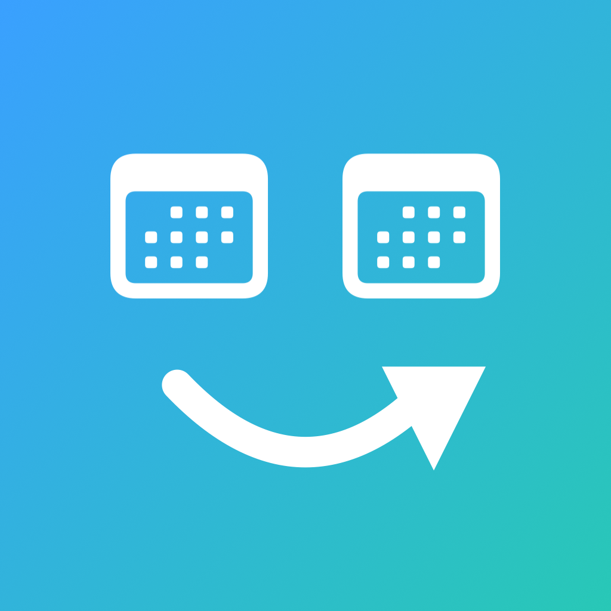
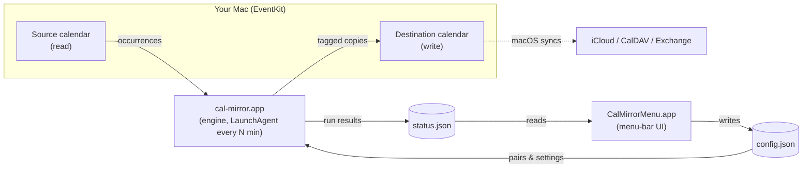

<div align="center">



# cal-mirror

**One-way mirror between any two calendars on your Mac — with a menu-bar UI.**

Point a *source* calendar at a *destination* calendar and cal-mirror keeps the
destination in sync: idempotent, one-directional, and scheduled. No servers, no
credentials — it works entirely through the calendars already on your Mac, and
lets macOS sync the destination up to iCloud / CalDAV / Exchange for you.


</div>

---

## ✨ Why

Some calendars you can see but not reshare — a subscribed work calendar, a
read-only team feed, an account you don't control. cal-mirror makes an **editable,
re-shareable copy** on a calendar you *do* control. Because the copy lives in a
normal account, macOS then pushes it wherever that account syncs.

## 🎯 Features

- **Any → any.** Mirror any calendar into any other, configured as a list of pairs.
- **Idempotent & one-way.** Re-runs never duplicate; the source is authoritative and is never written to.
- **Recurring-safe.** Recurring events are expanded into occurrences — no RRULE translation, and detached exceptions are already resolved by EventKit.
- **Non-destructive.** Each pair tags only its own copies, so two mirrors can share a destination and hand-added events are left untouched.
- **Menu-bar UI.** Health at a glance, Sync now, Pause, interval, and a pickers-driven window to add/edit pairs.
- **Heartbeat banner.** Optional all-day “last synced” marker right in the destination calendar — a glanceable liveness signal.
- **No credentials.** Reads and writes through EventKit; server sync is macOS's job.

## 🗺️ How it works



The **engine** runs on a schedule: for each enabled pair it reads the source over
a rolling window, expands occurrences, and upserts them into the destination
tagged with a per-mirror marker (`x-calmirror:<id>~<key>`) so its delete-sweep
only ever touches its own copies. The **UI** is a thin window onto `status.json`
and an editor for `config.json` — it never touches the calendar itself beyond
listing them for the pickers.

## 🚀 Install

> Requires macOS 14+ and the Xcode Command Line Tools (`xcode-select --install`).

```sh
git clone https://github.com/mattbaylor/cal-mirror.git
cd cal-mirror
./install.sh          # builds both apps, installs the LaunchAgents
```

On first run macOS prompts for **Calendar access** — click **Allow**. The apps are
ad-hoc signed by default; to keep the grant across rebuilds, sign with your own
Developer ID:

```sh
CM_SIGN_ID="Developer ID Application: Your Name (TEAMID)" ./install.sh
```

Then configure a pair — either in the menu bar (**Manage mirrors…**) or by editing
`~/.local/cal-mirror/config.json`.

## ⚙️ Configure

Code lives in the checkout; **runtime data lives in `~/.local/cal-mirror/`**
(`config.json`, `status.json`, logs). Copy the example to start:

```jsonc
{
  "paused": false,
  "intervalSeconds": 900,          // engine schedule
  "mirrors": [
    {
      "id": "work",                // stable, unique
      "name": "Work → Personal",
      "source": { "title": "Work",       "account": "you@work.example.com" },
      "dest":   { "title": "Work (Copy)", "account": "you@personal.example.com" },
      "enabled": true,
      "showHeartbeat": true,       // all-day “last synced” banner
      "windowPastDays": 30,
      "windowFutureDays": 365
    }
  ]
}
```

`account` is optional (matching falls back to the calendar title). Copied fields:
**title, start/end, all-day, location, timezone** — a lightweight free/busy-style
shadow (no attendees, notes bodies, or attachments).

## 🖥️ Menu bar

```
 cal-mirror — Last sync 2 min ago
 ────────────────────────────────
 ✓ Work → Personal        ▸  439 events (+0 ~0 −0)
 ────────────────────────────────
 Sync now
 Pause syncing
 Sync interval            ▸  5 / 15 ✓ / 30 / 60 min
 ────────────────────────────────
 Manage mirrors…          (add/edit pairs with calendar pickers)
 Open Calendar · Open log · Quit
```

Icon = worst mirror: ✓ ok · ⚠︎ stale (last run > 2× interval) · ✗ error · ⏸ paused.

## 🛠️ Commands

| Command | Does |
|---------|------|
| `./install.sh` | Build both apps, (re)load the LaunchAgents |
| `./run.sh` | Sync now (kickstarts the engine) |
| `./run.sh --list` | List every Mac calendar (title + account) to the log |
| `./run.sh --purge` | Remove **all** mirror-tagged events from configured destinations |
| `./uninstall.sh` | Unload the LaunchAgents (keeps apps + events) |
| `tail -f ~/.local/cal-mirror/mirror.log` | Watch the engine log |

## 🔐 Permissions & signing

- The engine needs **Calendar** access (read + write); the UI needs read (for the pickers). Each is a one-time macOS prompt.
- On recent macOS a CLI binary can't obtain a Calendar prompt — that's why each tool ships as a tiny signed `.app` bundle.
- A stable code-signing identity ties the grant to the app so it **survives rebuilds**. Ad-hoc signatures change every build and re-prompt; set `CM_SIGN_ID` to a Developer ID to avoid that.
- **TCC tip:** if a prompt won't appear, macOS has muted it (usually from rapid repeat requests). Reset with `killall tccd; tccutil reset Calendar <bundle-id>`, unload the agents, then launch **one** instance via `open`. Verify via a scheduled (launchd) run — a direct shell exec is attributed to the shell and shows a false “denied”.

## 📦 Releases (maintainers)

Signed **and notarized** builds pass Gatekeeper with no warning. One-time, store
a notary credential (an [app-specific password](https://support.apple.com/en-us/102654)):

```sh
xcrun notarytool store-credentials cal-mirror-notary \
  --apple-id "you@example.com" --team-id "YOURTEAMID" --password "xxxx-xxxx-xxxx-xxxx"
```

Then build → notarize → staple → package, and publish:

```sh
CM_SIGN_ID="Developer ID Application: Your Name (TEAMID)" ./release.sh v1.0.0
gh release create v1.0.0 dist/*-v1.0.0.zip -t v1.0.0 -n "Signed & notarized build."
```

`release.sh` signs with hardened runtime + secure timestamp, submits each app to
Apple, staples the ticket, and drops zips in `./dist`.

## 🧑‍💻 Development

Pure Swift, no package manager — two single-file targets built with `swiftc`:

| File | Target |
|------|--------|
| `main.swift` | `cal-mirror.app` — EventKit sync engine (CLI) |
| `menu.swift` | `CalMirrorMenu.app` — SwiftUI `MenuBarExtra` + management window |

`./build.sh` / `./build-ui.sh` compile, bundle, and sign each. LaunchAgent
templates live in `launchd/`; `install.sh` fills in paths at install time.

## 📄 License

MIT © Matt Baylor
