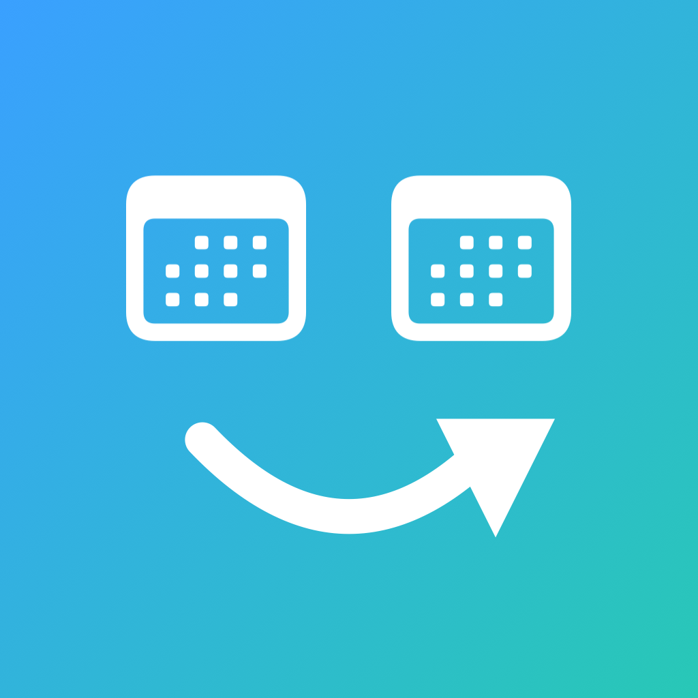
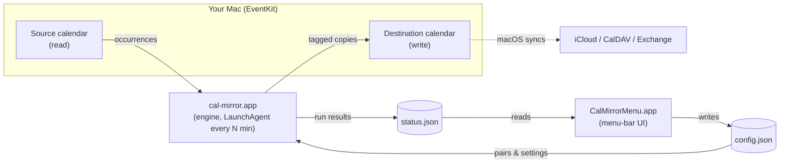

<div align="center">



# cal-mirror

**One-way mirror between any two of your calendars — on Mac, iPhone and iPad.**

Point a *source* calendar at a *destination* calendar and cal-mirror keeps the
destination in sync: idempotent, one-directional, and scheduled. No servers, no
credentials — it works entirely through the calendars already on your device, and
lets the OS sync the destination up to iCloud / CalDAV / Exchange for you.


</div>

---

## ✨ Why

Some calendars you can see but not reshare — a subscribed work calendar, a
read-only team feed, an account you don't control. cal-mirror makes an **editable,
re-shareable copy** on a calendar you *do* control. Because the copy lives in a
normal account, macOS then pushes it wherever that account syncs.

## 📦 Two products, one engine

| | Built from | Runs as |
|---|---|---|
| **Standalone macOS** (this README) | `./install.sh` — free, MIT | A launchd daemon + `CalMirrorMenu.app` in the menu bar |
| **App Store apps** ([`apple/`](apple/README.md)) | Xcode / `release-appstore.sh` — $0.99 universal | Sandboxed apps on iPhone, iPad and Mac; no LaunchAgent |

Both run the **same** sync engine, [`CalMirrorKit`](apple/README.md#shared-package--calmirrorkit) —
`main.swift` is a thin daemon wrapper around it. Everything below about configuration,
projection and tags applies to both, since they read the same `config.json` shape.

## 🎯 Features

- **Any → any.** Mirror any calendar into any other, configured as a list of pairs.
- **Idempotent & one-way.** Re-runs never duplicate; the source is authoritative and is never written to.
- **Per-field privacy.** Choose per mirror what crosses over — from a full copy down to a redacted “Busy” block — and override any single event with a tag in its notes.
- **Selective copy.** Copy only *some* source events by tagging them in the notes and giving the mirror an `include`/`reject` tag rule — e.g. pull just your `#ref` events into a shared availability calendar.
- **Recurring-safe.** Recurring events are expanded into occurrences — no RRULE translation, and detached exceptions are already resolved by EventKit.
- **Non-destructive.** Each pair tags only its own copies, so two mirrors can share a destination and hand-added events are left untouched.
- **Menu-bar UI.** Health at a glance, Sync now, Pause, interval, and a pickers-driven window to add/edit pairs.
- **Heartbeat banner.** Optional all-day “last synced” marker right in the destination calendar — a glanceable liveness signal.
- **No credentials.** Reads and writes through EventKit; server sync is macOS's job.

## 🗺️ How it works


```mermaid
flowchart LR
    subgraph Mac["Your Mac (EventKit)"]
        SRC["Source calendar<br/>(read)"]
        DST["Destination calendar<br/>(write)"]
    end
    ENG["cal-mirror.app<br/>(engine, LaunchAgent every N min)"]
    UI["CalMirrorMenu.app<br/>(menu-bar UI)"]
    CFG[("config.json")]
    ST[("status.json")]

    SRC -- occurrences --> ENG
    ENG -- tagged copies --> DST
    CFG -- pairs & settings --> ENG
    ENG -- run results --> ST
    UI -- writes --> CFG
    ST -- reads --> UI
    DST -. macOS syncs .-> Cloud["iCloud / CalDAV / Exchange"]
```

The **engine** runs on a schedule: for each enabled pair it reads the source over
a rolling window, expands occurrences, and upserts them into the destination
tagged with a per-mirror marker (`x-calmirror:<id>~<key>`) so its delete-sweep
only ever touches its own copies. The **UI** is a thin window onto `status.json`
and an editor for `config.json` — it never touches the calendar itself beyond
listing them for the pickers.

## 🚀 Install

> Requires macOS 14+ and the Xcode Command Line Tools (`xcode-select --install`).

```sh
git clone https://github.com/mattbaylor/cal-mirror.git
cd cal-mirror
./install.sh          # builds both apps, installs the LaunchAgents
```

On first run macOS prompts for **Calendar access** — click **Allow**. The apps are
ad-hoc signed by default; to keep the grant across rebuilds, sign with your own
Developer ID:

```sh
CM_SIGN_ID="Developer ID Application: Your Name (TEAMID)" ./install.sh
```

Then configure a pair — either in the menu bar (**Manage mirrors…**) or by editing
`~/.local/cal-mirror/config.json`.

## ⚙️ Configure

Code lives in the checkout; **runtime data lives in `~/.local/cal-mirror/`**
(`config.json`, `status.json`, logs). Copy the example to start:

```jsonc
{
  "paused": false,
  "intervalSeconds": 900,          // engine schedule
  "mirrors": [
    {
      "id": "work",                // stable, unique
      "name": "Work → Personal",
      "source": { "title": "Work",       "account": "you@work.example.com" },
      "dest":   { "title": "Work (Copy)", "account": "you@personal.example.com" },
      "enabled": true,
      "showHeartbeat": true,       // all-day “last synced” banner
      "windowPastDays": 30,
      "windowFutureDays": 365
    }
  ]
}
```

`account` is optional (matching falls back to the calendar title). Start/end,
all-day, and timezone are always copied — they define the block. Everything else
is governed by `projection` (below).

## 🔒 What crosses over (`projection`)

Each mirror decides, field by field, how much of the source event to replicate.
An **absent `projection` block keeps the historical behavior** (real title +
location, no notes/alarms). The menu bar exposes this as three presets plus
**Custom**; in `config.json` it's:

```jsonc
"projection": {
  "title":        "copy",     // "copy" | "redact"
  "titleText":    "Busy",     // shown when title = "redact"
  "location":     true,
  "notes":        "none",     // "none" | "tags" | "full"  (legacy true/false still read)
  "alarms":       false,       // off avoids duplicate notifications on the dest
  "availability": "source"     // "source" | "busy" (force the block to read busy)
}
```

| Preset | Meaning |
|--------|---------|
| **Copy details** | Real title + location, **no notes** (the default). |
| **Full copy** | Adds the whole note. As complete as EventKit allows. |
| **Busy only** | Title → `titleText`, drops location/notes, forces busy. |
| **Custom** | Anything else — including `notes: "tags"`, below. |

> **"Copy details" does not copy notes.** If your `#tags` aren't reaching the
> destination, this is almost always why: `copyNotesTags` only has an effect
> once notes actually cross over. Pick **Full copy**, or **Custom → Notes →
> Tags only**.

*Two EventKit limits worth knowing:* **attendees can't be replicated** (no API
to set participants), and the source event's **URL is unavailable** because that
field carries cal-mirror's own per-copy marker.

### Notes tags

Tags live in a **source** event's **notes** (not the title). A tag is `#`
followed by every non-whitespace character up to the next space — any ASCII is
allowed inside, so `#ref-cal` and `#skip_2` are each one tag. A tag is only
recognized where the `#` starts the notes or follows whitespace, and an event may
carry several: `#nomirror #ref-cal`. Matching is case-insensitive and by *whole
token*, so `#ref` and `#ref-cal` are different tags.

The three control tags override a mirror's projection for one event:

| Tag | Effect |
|-----|--------|
| `#nomirror` | Skip this event entirely — never copied, and any prior copy is removed. |
| `#private` | Copy as a redacted busy block, even on a full-copy mirror. |
| `#public` | Copy in full, even on a Busy-only mirror. |

Control tags are always stripped from the copy.

### Selective copy (`tagFilter`)

Give a mirror a `tagFilter` to copy only *some* source events, keyed off the
notes tags above. A mirror runs in **one** mode — `include` **or** `reject`,
never both:

```jsonc
"tagFilter": { "mode": "include", "tags": ["#ref"] }   // copy ONLY events whose notes carry #ref
"tagFilter": { "mode": "reject",  "tags": ["#skip"] }  // copy everything EXCEPT events carrying #skip
```

No `tagFilter` (or an empty `tags` list) copies everything — the historical
behavior. This is the referee-availability play: tag the events you're free to
ref with `#ref` in their notes, point an `include`/`#ref` mirror with a Busy-only
projection at a calendar you share, and only those blocks cross over.

### Carrying tags without the note (`"notes": "tags"`)

Sometimes you want a selection tag to reach the destination but not the note it
sits in — a personal calendar feeding a shared one, say. Set the mirror's
projection to:

```jsonc
"projection": { "notes": "tags" }     // Custom → Notes → "Tags only"
```

The copy's notes become just the event's tags on one line, in source order, and
the prose never crosses. Control tags (`#nomirror`/`#private`/`#public`) and
`#-…` tags are dropped; `#+…` is kept verbatim. An event with no surviving tag
gets no notes at all. `copyNotesTags` is not consulted in this mode — choosing
it *is* the choice to carry tags.

### Keeping tags in the copy (`copyNotesTags`)

When a mirror **projects the whole note** (`"notes": "full"`), your other `#tags` are
stripped from the copied notes by default so they don't leak. Set
`"copyNotesTags": true` on the mirror to keep them. Two per-tag overrides beat the
mirror setting either way — the `+`/`-` is part of the tag (so it matters for
matching too):

| Tag form | In the copied notes |
|----------|---------------------|
| `#-foo` | Always **removed**, whatever `copyNotesTags` says. |
| `#+foo` | Always **kept** (verbatim, `+` included), whatever `copyNotesTags` says. |

> **Tags moved to notes in v1.2.** Earlier versions read `#nomirror`/`#private`/
> `#public` from the event **title**; those are no longer honored there. Move any
> such tags into the event's notes.

## 🖥️ Menu bar

```
 cal-mirror — Last sync 2 min ago
 ────────────────────────────────
 ✓ Work → Personal        ▸  439 events (+0 ~0 −0)
 ────────────────────────────────
 Sync now
 Pause syncing
 Sync interval            ▸  5 / 15 ✓ / 30 / 60 min
 ────────────────────────────────
 Manage mirrors…          (add/edit pairs with calendar pickers)
 Open Calendar · Open log · Quit
```

Icon = worst mirror: ✓ ok · ⚠︎ stale (last run > 2× interval) · ✗ error · ⏸ paused.

**If the icon is clipped off the menu bar** (a narrow display plus many extras),
the management window is still reachable — the icon is not the only way in:

```bash
open -a CalMirrorMenu
```

That reopens the running app straight to **Manage Mirrors**. Only if the app is
*not* already running does the flag form matter (`open -a CalMirrorMenu --args
--manage`); LaunchServices drops `--args` for an app that is already up, and the
LaunchAgent keeps this one up.

## 🛠️ Commands

| Command | Does |
|---------|------|
| `./install.sh` | Build both apps, (re)load the LaunchAgents |
| `./run.sh` | Sync now (kickstarts the engine) |
| `./run.sh --list` | List every Mac calendar (title + account) to the log |
| `./run.sh --purge` | Remove **all** mirror-tagged events from configured destinations |
| `open -a CalMirrorMenu` | Open **Manage Mirrors** without the menu-bar icon |
| `./release-appstore.sh` | Build + validate the App Store artifacts (see Releases) |
| `./uninstall.sh` | Unload the LaunchAgents (keeps apps + events) |
| `tail -f ~/.local/cal-mirror/mirror.log` | Watch the engine log |

## 🔐 Permissions & signing

- The engine needs **Calendar** access (read + write); the UI needs read (for the pickers). Each is a one-time macOS prompt.
- On recent macOS a CLI binary can't obtain a Calendar prompt — that's why each tool ships as a tiny signed `.app` bundle.
- A stable code-signing identity ties the grant to the app so it **survives rebuilds**. Ad-hoc signatures change every build and re-prompt; set `CM_SIGN_ID` to a Developer ID to avoid that.
- **TCC tip:** if a prompt won't appear, macOS has muted it (usually from rapid repeat requests). Reset with `killall tccd; tccutil reset Calendar <bundle-id>`, unload the agents, then launch **one** instance via `open`. Verify via a scheduled (launchd) run — a direct shell exec is attributed to the shell and shows a false “denied”.

## 📦 Releases (maintainers)

Two products, two paths. Both live at the same version — bump
`Info.plist` + `Info-ui.plist` (standalone) and both `apple/*/project.yml`
(`MARKETING_VERSION` / `CURRENT_PROJECT_VERSION`) together.

### Standalone — Developer ID + notarize

Signed **and notarized** builds pass Gatekeeper with no warning. One-time, store
a notary credential (an [app-specific password](https://support.apple.com/en-us/102654)):

```sh
xcrun notarytool store-credentials cal-mirror-notary \
  --apple-id "you@example.com" --team-id "YOURTEAMID" --password "xxxx-xxxx-xxxx-xxxx"
```

Then build → notarize → staple → package, and publish:

```sh
CM_SIGN_ID="Developer ID Application: Your Name (TEAMID)" ./release.sh v1.3.0
gh release create v1.3.0 dist/*-v1.3.0.zip -t v1.3.0 -n "Signed & notarized build."
```

`release.sh` signs with hardened runtime + secure timestamp, submits each app to
Apple, staples the ticket, and drops zips in `./dist`. Note it uses its version
argument only for the zip filenames and the tag — it never touches the plists.

### App Store — build in CI, not locally

> [!IMPORTANT]
> **App Store builds must come from CI.** Every binary records its build machine
> in `BuildMachineOSBuild`, and Apple rejects anything built on a beta OS:
> `ITMS-90301: Apple is not currently accepting applications built with this
> version of the OS.` If the maintainer's Mac is running a macOS beta, nothing it
> archives can ship.

Run the **Release to App Store Connect** workflow
([`.github/workflows/release.yml`](.github/workflows/release.yml)) from the
Actions tab. It picks the newest non-beta Xcode, **fails outright on a beta
runner OS**, then archives, validates, and — only if you tick `upload` —
delivers to App Store Connect. Leaving `upload` unticked builds and validates
without spending a build number.

It drives [`release-appstore.sh`](release-appstore.sh), which you can also run
locally for a build-and-validate check. The script's header documents the
signing rules the hard way: archives are signed for **distribution at archive
time** using manually managed profiles, never archived unsigned and re-signed on
export (that silently drops the macOS sandbox entitlement), and the `.pkg` needs
a **second** certificate, `3rd Party Mac Developer Installer`.

CI needs nine repository secrets — the distribution and installer certificates
(`.p12` + password each), both provisioning profiles, and an App Store Connect
API key (`ASC_KEY_ID`, `ASC_ISSUER_ID`, `ASC_KEY_P8`).

Note that `altool --validate-app` returns *VERIFY SUCCEEDED* on binaries Apple
later rejects, so a clean validate is necessary, not sufficient.

## 🧑‍💻 Development

The standalone apps are two `swiftc` targets; the shared engine is a Swift package.

| Path | What |
|------|------|
| `main.swift` | `cal-mirror.app` — thin launchd daemon around the engine |
| `menu.swift` | `CalMirrorMenu.app` — SwiftUI `MenuBarExtra` + management window |
| `apple/Sources/CalMirrorKit/` | The engine both products share — config, projection, tags, reconciler |
| `apple/Sources/cmk-check/` | Pure-logic self-check; gates CI, needs no Xcode |
| `apple/Shared/` | SwiftUI shared by the iOS and macOS App Store apps |
| `apple/{ios,mac}/` | The two App Store shells — see [`apple/README.md`](apple/README.md) |

`./build.sh` / `./build-ui.sh` compile, bundle, and sign the standalone pair —
`build.sh` compiles `main.swift` **together with** `CalMirrorKit`, so there is one
engine implementation, not two. LaunchAgent templates live in `launchd/`;
`install.sh` fills in paths at install time.

Run the self-check before pushing — CI runs exactly this:

```sh
cd apple && swift run cmk-check
```

## 📄 License

MIT © Matt Baylor
